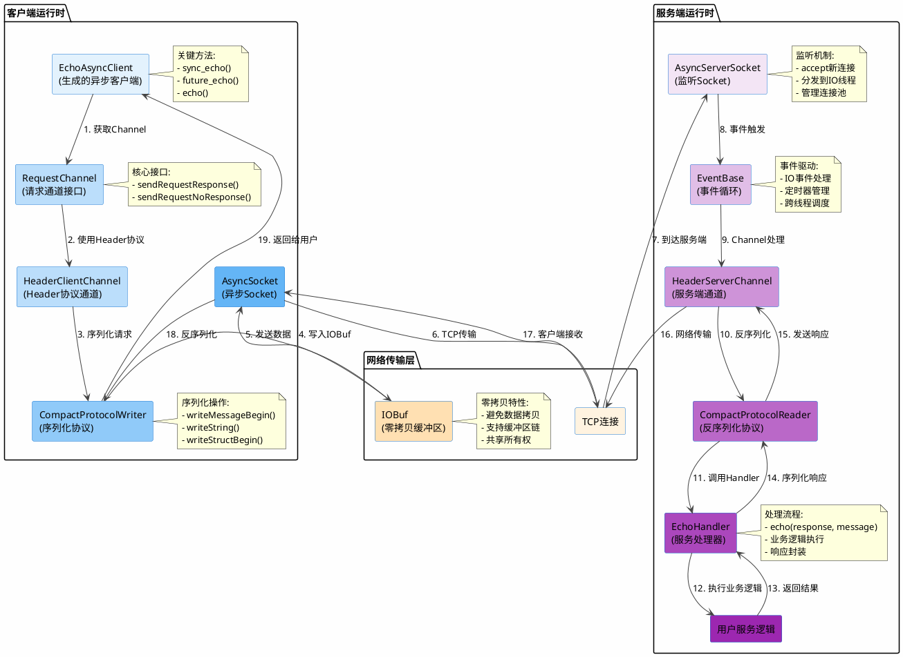
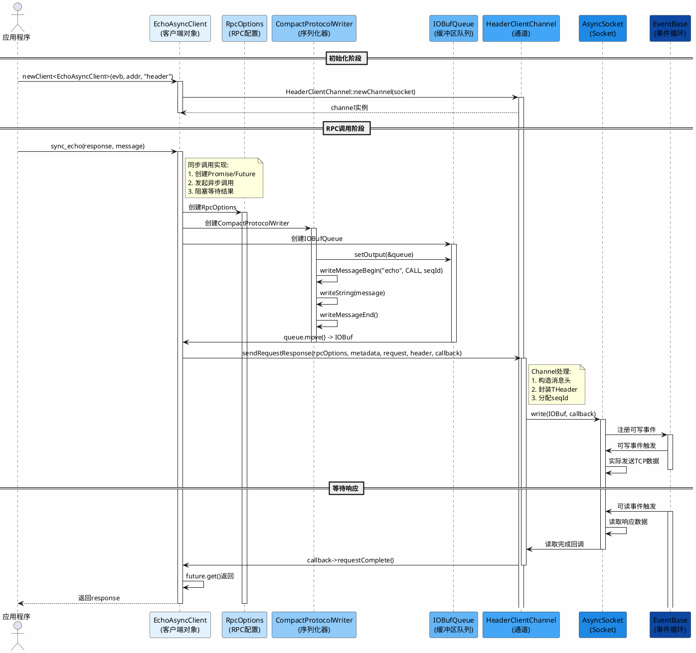
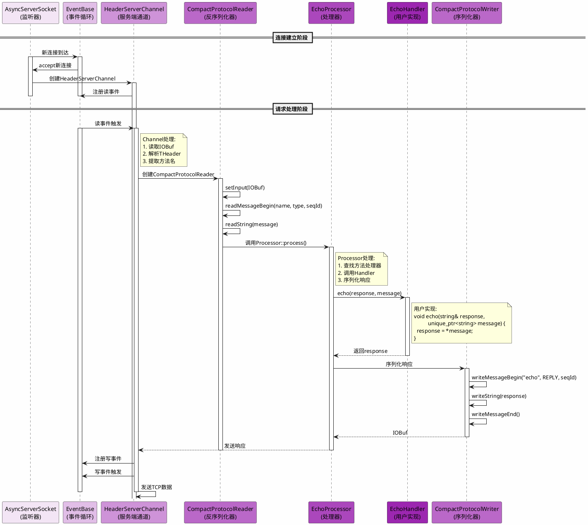
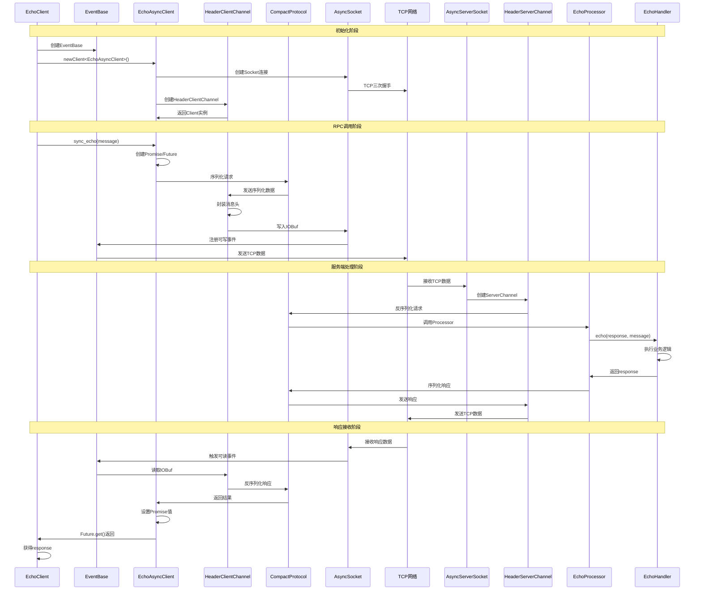

# FBThrift框架架构深度分析

## 目录
1. [项目概述](#项目概述)
2. [核心模块架构](#核心模块架构)
3. [模块交互关系图](#模块交互关系图)
4. [EchoClient端到端工作流](#echoclient端到端工作流)
5. [关键接口和函数](#关键接口和函数)
6. [性能优化技术](#性能优化技术)

---

## 项目概述

Facebook Thrift (FBThrift) 是一个高性能的序列化和RPC框架，基于Apache Thrift演进而来。本项目分析基于EchoClient示例，深入剖析FBThrift的完整工作流程。

### 核心特性
- **编译器**: 从零重写的Thrift编译器，支持多语言代码生成
- **异步服务器**: Cpp2异步服务器，性能提升4倍
- **零拷贝**: 基于folly::IOBuf的零拷贝技术
- **多协议支持**: Binary、Compact、JSON等序列化协议

---

## 核心模块架构

### 1. 编译器模块 (thrift/compiler/)

#### 1.1 编译器架构
```
编译器流程:
.thrift文件 → 词法分析(Lexer) → 语法分析(Parser) → AST构建 → 语义分析 → 代码生成
```

**关键组件**:
- **Lexer** (`parse/lexer.h`): 词法分析器，将.thrift文件转换为token流
- **Parser** (`parse/parser.h`): 语法分析器，构建抽象语法树(AST)
- **AST节点** (`ast/`): 定义各种AST节点类型
  - `t_program`: 程序节点
  - `t_service`: 服务定义
  - `t_struct`: 结构体定义
  - `t_function`: 函数定义
- **代码生成器** (`generate/`): 为不同语言生成代码

#### 1.2 编译器入口
```cpp
// thrift/compiler/main.cc
int main(int argc, char** argv) {
  auto result = compile({argv, argv + argc});
  for (const auto& diag : result.detail.diagnostics()) {
    std::cerr << diag << "\n";
  }
  return static_cast<int>(result.retcode);
}
```

#### 1.3 编译流程
```cpp
// thrift/compiler/compiler.cc
compile_result compile(const std::vector<std::string>& arguments) {
  // 1. 解析命令行参数
  parse_args(arguments, pparams, gparams, dparams);
  
  // 2. 解析.thrift文件
  auto program_bundle = parse_and_mutate_program(sm, filename, params);
  
  // 3. 语义分析和验证
  validate_program(program);
  
  // 4. 代码生成
  for (auto& target : targets) {
    generator->generate(program);
  }
}
```

### 2. 运行时库模块 (thrift/lib/)

#### 2.1 C++运行时库架构

**cpp2/ (第二代C++库)**:
- **async/**: 异步框架
  - `RequestChannel`: 请求通道接口
  - `ClientChannel`: 客户端通道
  - `HeaderClientChannel`: Header协议客户端通道
  - `RocketClientChannel`: Rocket协议客户端通道
- **protocol/**: 序列化协议
  - `CompactProtocol`: 紧凑二进制协议
  - `BinaryProtocol`: 标准二进制协议
- **server/**: 服务器实现
  - `ThriftServer`: 异步服务器
  - `BaseThriftServer`: 服务器基类
- **gen/**: 生成的代码模板
  - `client_h.h`: 客户端头文件模板
  - `service_h.h`: 服务端头文件模板

**cpp/ (第一代C++库)**:
- 提供向后兼容性
- 同步阻塞式API

### 3. 序列化模块

#### 3.1 协议层次结构
```
ProtocolBase (基类)
    ├── CompactProtocolWriter/Reader
    ├── BinaryProtocolWriter/Reader
    └── JSONProtocolWriter/Reader
```

#### 3.2 CompactProtocol特性
```cpp
// thrift/lib/cpp2/protocol/CompactProtocol.h
class CompactProtocolWriter : public detail::ProtocolBase {
  // Varint编码减少数据大小
  // 支持零拷贝操作
  // Protocol ID: 0x82
  // Protocol Version: 0x02
  
  uint32_t writeMessageBegin(folly::StringPiece name, 
                              MessageType messageType, 
                              int32_t seqid);
  uint32_t writeStructBegin(const char* name);
  uint32_t writeFieldBegin(const char* name, TType fieldType, int16_t fieldId);
  // ... 其他序列化方法
};
```

### 4. RPC框架模块

#### 4.1 客户端架构
```
GeneratedAsyncClient (生成的客户端基类)
    ├── 持有 RequestChannel
    ├── 提供同步/异步调用接口
    └── 支持Future/Promise模式
```

**客户端Channel层次**:
```
RequestChannel (接口)
    └── ClientChannel
        ├── HeaderClientChannel (Header协议)
        ├── RocketClientChannel (Rocket协议)
        └── H2ClientConnection (HTTP/2)
```

#### 4.2 服务器架构
```
ThriftServer
    ├── AsyncServerSocket (监听socket)
    ├── EventBase (事件循环)
    ├── IOThreadPoolExecutor (IO线程池)
    ├── SSLContextConfig (SSL配置)
    └── ServiceHandler (服务处理器)
```

---

## 模块交互关系图

### FBThrift运行期整体架构图



### 客户端详细调用流程



### 服务端详细处理流程



---

## EchoClient端到端工作流

### 1. 客户端初始化阶段

#### 1.1 创建EventBase
```cpp
// thrift/example/cpp2/client/EchoClient.cpp
folly::EventBase evb;
```

**EventBase作用**:
- 提供事件循环机制
- 管理异步IO事件
- 支持定时器回调

#### 1.2 创建客户端
```cpp
// thrift/perf/cpp2/util/Util.h
auto client = newClient<EchoAsyncClient>(&evb, addr, FLAGS_transport);
```

**newClient函数实现**:
```cpp
template <typename AsyncClient>
static std::unique_ptr<AsyncClient> newClient(
    folly::EventBase* evb,
    const folly::SocketAddress& addr,
    folly::StringPiece transport,
    bool encrypted = false) {
  if (transport == "header") {
    return newHeaderClient<AsyncClient>(evb, addr);
  }
  if (transport == "rocket") {
    return newRocketClient<AsyncClient>(evb, addr, encrypted);
  }
  if (transport == "http2") {
    return newHTTP2Client<AsyncClient>(evb, addr, encrypted);
  }
  return nullptr;
}
```

#### 1.3 创建HeaderClientChannel
```cpp
template <typename AsyncClient>
static std::unique_ptr<AsyncClient> newHeaderClient(
    folly::EventBase* evb, const folly::SocketAddress& addr) {
  // 1. 创建Socket连接
  auto sock = apache::thrift::perf::getSocket(evb, addr, false);
  
  // 2. 创建HeaderClientChannel
  auto chan = HeaderClientChannel::newChannel(std::move(sock));
  
  // 3. 创建客户端实例
  return std::make_unique<AsyncClient>(std::move(chan));
}
```

**关键步骤**:
1. **创建Socket**: 使用`getSocket()`建立TCP连接
2. **创建Channel**: 封装Socket为HeaderClientChannel
3. **创建Client**: 用Channel初始化AsyncClient

### 2. RPC调用阶段

#### 2.1 同步调用入口
```cpp
// thrift/example/cpp2/client/EchoClient.cpp
client->sync_echo(response, message);
```

**sync_echo实现原理**:
```cpp
// 生成的客户端代码（伪代码）
void EchoAsyncClient::sync_echo(std::string& response, const std::string& message) {
  // 1. 创建Promise/Future
  folly::Promise<std::string> promise;
  auto future = promise.getFuture();
  
  // 2. 发起异步调用
  auto callback = std::make_unique<FutureCallback>(std::move(promise));
  this->echo(std::move(callback), message);
  
  // 3. 阻塞等待结果
  response = std::move(future).get();
}
```

#### 2.2 异步调用流程
```cpp
// 生成的客户端代码（伪代码）
void EchoAsyncClient::echo(
    std::unique_ptr<RequestCallback> callback,
    const std::string& message) {
  
  // 1. 创建RpcOptions
  RpcOptions rpcOptions;
  
  // 2. 序列化请求
  CompactProtocolWriter writer;
  IOBufQueue queue;
  writer.setOutput(&queue);
  writer.writeString(message);
  auto request = std::make_unique<IOBuf>(queue.move());
  
  // 3. 发送请求
  channel_->sendRequestResponse(
      rpcOptions,
      MethodMetadata("echo"),
      SerializedRequest(std::move(request)),
      std::make_shared<THeader>(),
      std::move(callback)
  );
}
```

#### 2.3 Channel发送请求
```cpp
// thrift/lib/cpp2/async/HeaderClientChannel.h
void HeaderClientChannel::sendRequestResponse(
    const RpcOptions& options,
    MethodMetadata&& metadata,
    SerializedRequest&& request,
    std::shared_ptr<THeader> header,
    RequestClientCallback::Ptr callback) {
  
  // 1. 构造消息头
  THeader::StringToStringMap headers;
  // 添加各种header信息
  
  // 2. 封装消息
  auto message = envelopeMessage(
      metadata.name(),
      std::move(request),
      header.get()
  );
  
  // 3. 通过Cpp2Channel发送
  cpp2Channel_->sendMessage(
      nullptr,  // callback
      std::move(message),
      header.get()
  );
}
```

#### 2.4 Socket发送数据
```cpp
// folly/io/async/AsyncSocket.h
void AsyncSocket::write(
    WriteCallback* callback,
    const void* buffer,
    size_t bytes) {
  
  // 1. 将数据写入发送缓冲区
  // 2. 注册可写事件
  // 3. 在EventBase中触发实际发送
}
```

### 3. 服务端处理阶段

#### 3.1 接收连接
```cpp
// thrift/lib/cpp2/server/ThriftServer.h
// ThriftServer监听端口，接受新连接

void ThriftServer::onNewConnection(
    folly::AsyncSocket::UniquePtr socket) {
  
  // 1. 创建HeaderServerChannel
  auto channel = HeaderServerChannel::create(std::move(socket));
  
  // 2. 创建Connection对象
  auto conn = std::make_shared<Cpp2Connection>(std::move(channel));
  
  // 3. 注册到EventBase
  conn->registerInEventBase();
}
```

#### 3.2 接收请求
```cpp
// thrift/lib/cpp2/async/HeaderServerChannel.h
void HeaderServerChannel::handleMessage(
    std::unique_ptr<IOBuf> message,
    THeader* header) {
  
  // 1. 解析消息头
  std::string methodName;
  int32_t seqId;
  parseMessageBegin(message, methodName, seqId);
  
  // 2. 查找方法处理器
  auto processor = getProcessor(methodName);
  
  // 3. 调用处理器
  processor->process(
      std::move(message),
      header,
      seqId
  );
}
```

#### 3.3 调用服务方法
```cpp
// thrift/example/cpp2/server/EchoService.cpp
void EchoHandler::echo(
    std::string& response,
    std::unique_ptr<std::string> message) {
  
  // 用户实现的服务逻辑
  response = *message;
}
```

#### 3.4 返回响应
```cpp
// 生成的服务端代码（伪代码）
void EchoProcessor::process(
    std::unique_ptr<IOBuf> request,
    THeader* header,
    int32_t seqId) {
  
  // 1. 反序列化请求
  CompactProtocolReader reader;
  reader.setInput(request.get());
  std::string message;
  reader.readString(message);
  
  // 2. 调用Handler
  std::string response;
  handler_->echo(response, std::move(message));
  
  // 3. 序列化响应
  CompactProtocolWriter writer;
  IOBufQueue queue;
  writer.setOutput(&queue);
  writer.writeString(response);
  
  // 4. 发送响应
  sendResponse(seqId, queue.move(), header);
}
```

### 4. 完整时序图



---

## 关键接口和函数

### 1. 编译器接口

#### 1.1 主编译函数
```cpp
// thrift/compiler/compiler.h
compile_result compile(const std::vector<std::string>& arguments);
```

**参数**:
- `arguments`: 命令行参数列表

**返回值**:
- `compile_result`: 包含返回码和诊断信息

#### 1.2 解析函数
```cpp
std::unique_ptr<t_program_bundle> parse_and_mutate_program(
    source_manager& sm,
    const std::string& filename,
    parsing_params params,
    diagnostic_params dparams = {});
```

**功能**: 解析.thrift文件并构建AST

### 2. 客户端接口

#### 2.1 RequestChannel接口
```cpp
// thrift/lib/cpp2/async/RequestChannel.h
class RequestChannel {
  virtual void sendRequestResponse(
      const RpcOptions&,
      MethodMetadata&&,
      SerializedRequest&&,
      std::shared_ptr<THeader>,
      RequestClientCallback::Ptr) = 0;
      
  virtual void sendRequestNoResponse(
      const RpcOptions&,
      MethodMetadata&&,
      SerializedRequest&&,
      std::shared_ptr<THeader>,
      RequestClientCallback::Ptr) = 0;
};
```

#### 2.2 GeneratedAsyncClient基类
```cpp
// thrift/lib/cpp2/async/AsyncClient.h
class GeneratedAsyncClient : public TClientBase {
  GeneratedAsyncClient(std::shared_ptr<RequestChannel> channel);
  virtual const char* getServiceName() const noexcept = 0;
  RequestChannel* getChannel() const noexcept;
  
 protected:
  std::shared_ptr<RequestChannel> channel_;
};
```

### 3. 服务端接口

#### 3.1 ThriftServer配置
```cpp
// thrift/lib/cpp2/server/ThriftServer.h
class ThriftServer : public BaseThriftServer,
                     public wangle::ServerBootstrap<Pipeline> {
  void setPort(int port);
  void setInterface(std::shared_ptr<ServerInterface> handler);
  void setNumIOWorkerThreads(int numThreads);
  void setNumCPUWorkerThreads(int numThreads);
  void setSSLContext(std::shared_ptr<folly::SSLContext> context);
  void serve();
};
```

#### 3.2 ServiceHandler接口
```cpp
// 生成的服务端代码
template <typename Service>
class ServiceHandler : virtual public Service::SvIf {
  // 用户继承此类并实现服务方法
};
```

### 4. 序列化接口

#### 4.1 ProtocolWriter接口
```cpp
// thrift/lib/cpp2/protocol/Protocol.h
class ProtocolWriter {
  virtual uint32_t writeMessageBegin(
      folly::StringPiece name, 
      MessageType messageType, 
      int32_t seqid) = 0;
  virtual uint32_t writeStructBegin(const char* name) = 0;
  virtual uint32_t writeFieldBegin(
      const char* name, TType fieldType, int16_t fieldId) = 0;
  virtual uint32_t writeString(folly::StringPiece str) = 0;
  // ... 其他方法
};
```

#### 4.2 ProtocolReader接口
```cpp
class ProtocolReader {
  virtual uint32_t readMessageBegin(
      std::string& name, 
      MessageType& messageType, 
      int32_t& seqid) = 0;
  virtual uint32_t readStructBegin(std::string& name) = 0;
  virtual uint32_t readFieldBegin(
      std::string& name, TType& fieldType, int16_t& fieldId) = 0;
  virtual uint32_t readString(std::string& str) = 0;
  // ... 其他方法
};
```

---

## 性能优化技术

### 1. 零拷贝技术

#### 1.1 IOBuf机制
```cpp
// folly/io/IOBuf.h
class IOBuf {
  // 支持零拷贝的缓冲区管理
  // 支持缓冲区链
  // 支持共享所有权
};
```

**优势**:
- 避免数据拷贝
- 减少内存分配
- 支持缓冲区复用

#### 1.2 序列化中的零拷贝
```cpp
// CompactProtocol支持零拷贝
uint32_t writeBinary(const IOBuf& str) {
  // 直接引用IOBuf，不拷贝数据
}
```

### 2. 异步IO优化

#### 2.1 EventBase事件循环
```cpp
// folly/io/async/EventBase.h
class EventBase {
  void loop();  // 事件循环
  void runInEventBaseThread(Func func);  // 跨线程调度
};
```

**优势**:
- 非阻塞IO
- 高效的事件分发
- 支持定时器

#### 2.2 连接复用
```cpp
// ThriftClient支持连接复用
class ThriftClient {
  // 多个请求共享同一个连接
  // 支持请求管道化
};
```

### 3. 内存优化

#### 3.1 对象池
```cpp
// 使用folly的内存池
folly::MemoryPool::getInstance()->allocate(size);
```

#### 3.2 缓冲区复用
```cpp
// IOBufQueue支持缓冲区复用
IOBufQueue queue;
queue.append(std::move(buf));
auto result = queue.move();  // 复用缓冲区
```

### 4. 编译优化

#### 4.1 内联优化
```cpp
// 关键路径使用FOLLY_ALWAYS_INLINE
FOLLY_ALWAYS_INLINE uint32_t writeFieldBegin(...);
```

#### 4.2 模板特化
```cpp
// 针对不同类型特化序列化方法
template <typename T>
void serialize(T& value);
```

---

## 总结

FBThrift框架通过以下核心设计实现了高性能和易用性：

1. **编译器**: 从.thrift到多语言代码的完整工具链
2. **异步架构**: 基于EventBase和Future/Promise的异步模型
3. **零拷贝**: IOBuf机制避免数据拷贝
4. **协议优化**: CompactProtocol等高效序列化协议
5. **模块化设计**: 清晰的模块边界和接口定义

EchoClient示例展示了FBThrift的典型使用流程：
1. 创建EventBase和AsyncClient
2. 通过Channel发送请求
3. Protocol序列化数据
4. Socket传输数据
5. 服务端接收并处理请求
6. 返回响应给客户端

这种架构设计使得FBThrift能够支持大规模分布式系统的高性能RPC通信。
