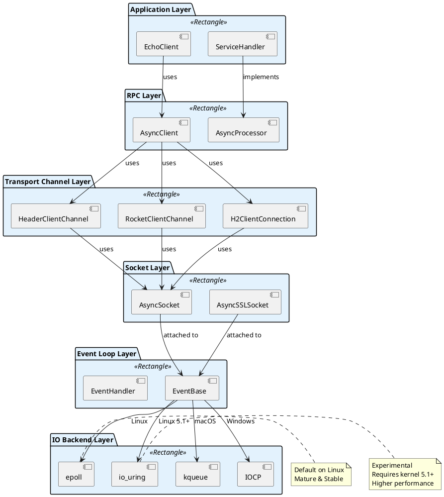
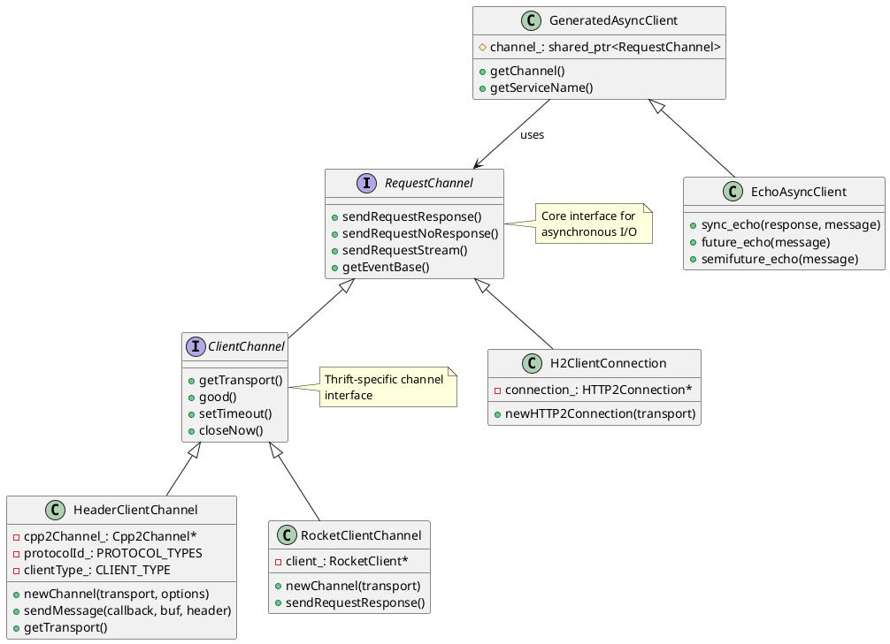
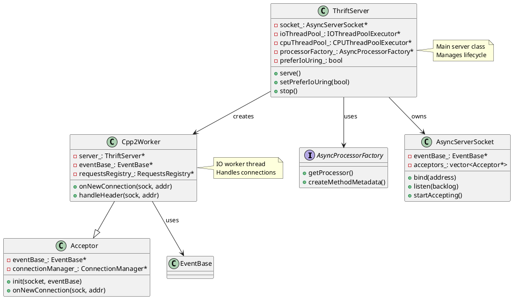
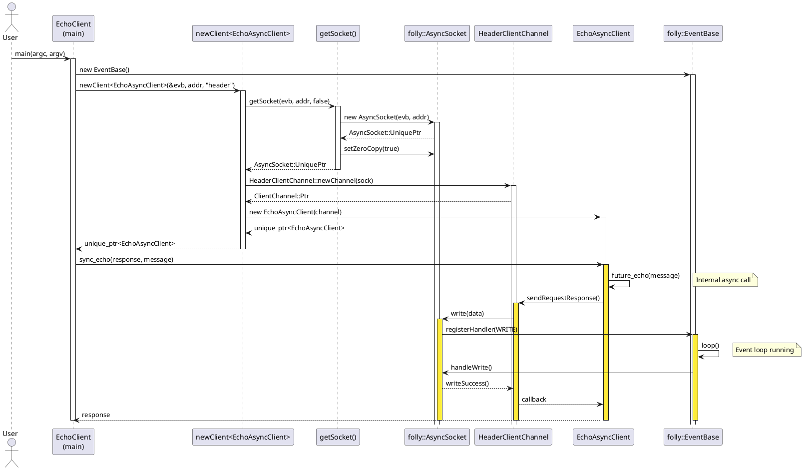
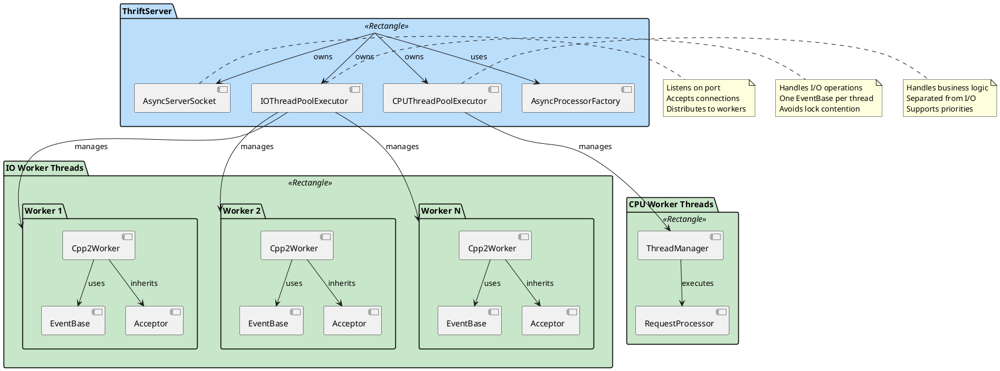
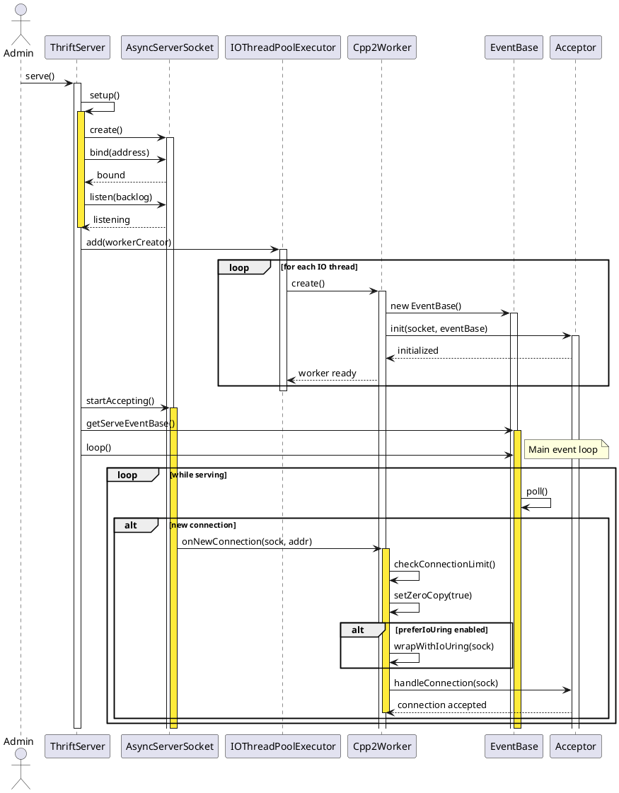
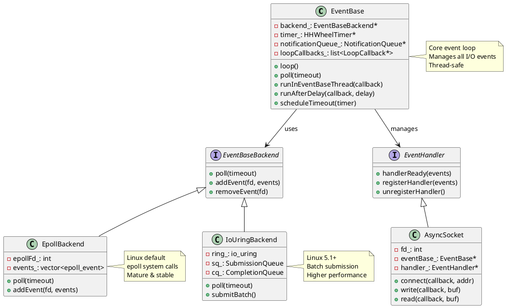
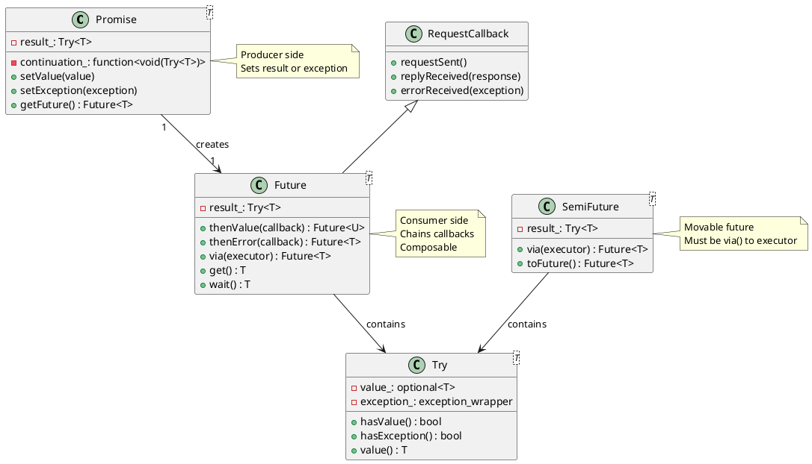
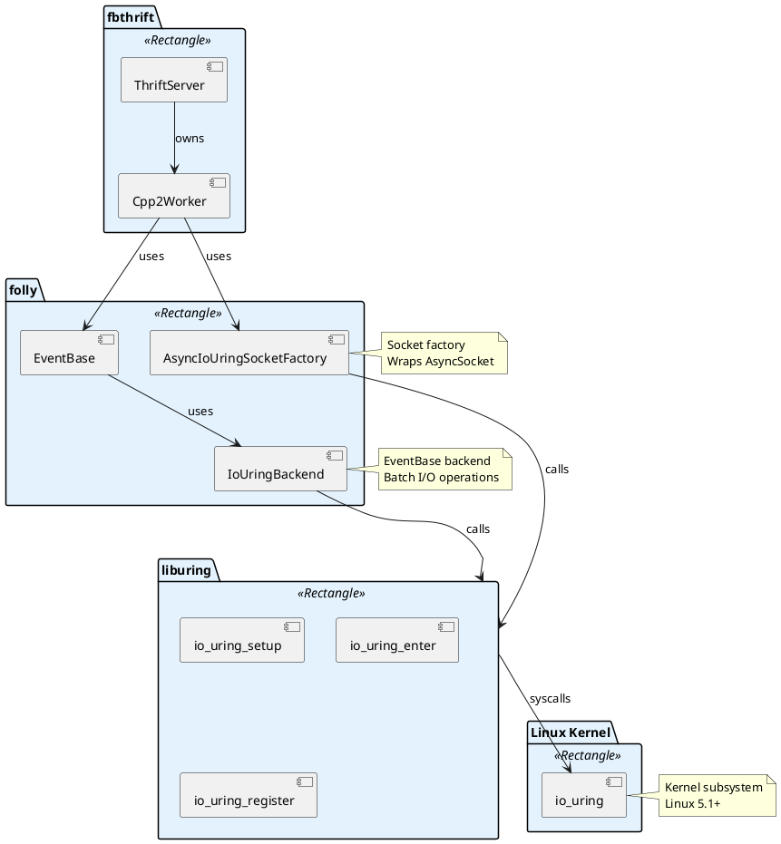
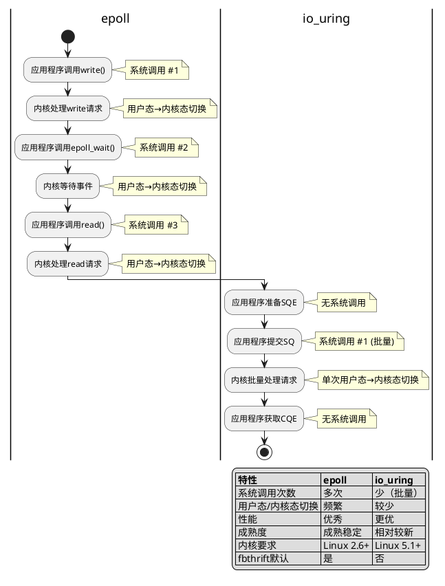

# FBThrift框架通信机制与io_uring支持分析报告

## 执行摘要

本报告基于fbthrift框架的EchoClient示例，深入分析了其通信机制和io_uring支持情况。通过代码分析和架构梳理，得出以下核心结论：

1. **epoll使用情况**: fbthrift不直接使用epoll，而是通过folly::EventBase间接使用，在Linux上默认使用epoll作为IO后端
2. **io_uring支持**: fbthrift已实现io_uring支持，但默认关闭，标记为experimental特性
3. **通信架构**: 采用Reactor模式，基于folly库的事件驱动架构，支持多种传输协议

---

## 一、分析背景与方法

### 1.1 分析目标
- 分析fbthrift通信框架与socket的通信方式
- 确认是否使用epoll及其使用方式
- 分析是否支持Linux io_uring特性

### 1.2 分析方法
- **入口点**: [thrift/example/cpp2/client/EchoClient.cpp](file:///home/zfz/code/fbthrift/thrift/example/cpp2/client/EchoClient.cpp)
- **分析方法**: 代码追踪、架构分析、依赖关系梳理
- **工具**: 代码搜索、文件读取、语义分析

### 1.3 项目背景
- **框架**: fbthrift (Facebook Thrift)
- **folly版本**: 30abf028d4773f07115c32c67d2e156b316c5417
- **支持协议**: Header, Rocket, HTTP2, InMemory

---

## 二、通信机制分析

### 2.1 整体架构

fbthrift采用分层架构设计，通信机制的核心层次如下：



### 2.2 核心类关系图

#### 2.2.1 客户端类继承关系



#### 2.2.2 服务端类继承关系



### 2.3 客户端通信流程

#### 2.3.1 客户端创建流程

基于EchoClient.cpp的分析，客户端创建遵循以下流程：



#### 2.3.2 客户端创建代码详解

**关键函数**: `getSocket()` - Socket创建工厂函数

**位置**: [thrift/perf/cpp2/util/Util.cpp](file:///home/zfz/code/fbthrift/thrift/perf/cpp2/util/Util.cpp)

**函数签名**:
```cpp
folly::AsyncSocket::UniquePtr getSocket(
    folly::EventBase* evb,                    // 事件循环
    const folly::SocketAddress& addr,         // 服务器地址
    bool encrypted,                           // 是否加密
    std::list<std::string> advertizedProtocols // 协议列表
);
```

**实现细节**:
```cpp
folly::AsyncSocket::UniquePtr getSocket(...) {
  // 1. 创建AsyncSocket，绑定到EventBase
  folly::AsyncSocket::UniquePtr sock(new folly::AsyncSocket(evb, addr));
  
  // 2. 如果需要加密，创建SSL Socket
  if (encrypted) {
    auto sslContext = std::make_shared<folly::SSLContext>();
    sslContext->setAdvertisedNextProtocols(advertizedProtocols);
    auto sslSock = new TAsyncSSLSocket(
        sslContext, evb, sock->detachNetworkSocket(), false);
    sslSock->sslConn(nullptr);
    sock.reset(sslSock);
  }
  
  // 3. 启用Zero Copy优化
  sock->setZeroCopy(true);
  return sock;
}
```

**关键点**:
1. **EventBase绑定**: Socket必须绑定到EventBase才能进行异步IO
2. **SSL支持**: 通过TAsyncSSLSocket包装实现加密通信
3. **零拷贝**: 启用MSG_ZEROCOPY优化，减少数据拷贝
4. **协议协商**: SSL握手时进行ALPN协议协商

**关键函数**: `newClient()` - 客户端创建模板函数

**位置**: [thrift/perf/cpp2/util/Util.h](file:///home/zfz/code/fbthrift/thrift/perf/cpp2/util/Util.h)

**函数签名**:
```cpp
template <typename AsyncClient>
static std::unique_ptr<AsyncClient> newClient(
    folly::EventBase* evb,
    const folly::SocketAddress& addr,
    folly::StringPiece transport,
    bool encrypted = false
);
```

**实现逻辑**:
```cpp
template <typename AsyncClient>
static std::unique_ptr<AsyncClient> newClient(...) {
  if (transport == "header") {
    return newHeaderClient<AsyncClient>(evb, addr);
  }
  if (transport == "rocket") {
    return newRocketClient<AsyncClient>(evb, addr, encrypted);
  }
  if (transport == "http2") {
    return newHTTP2Client<AsyncClient>(evb, addr, encrypted);
  }
  return nullptr;
}
```

#### 2.3.3 多协议支持

fbthrift支持多种传输协议，通过工厂模式创建不同的Channel：

| 协议 | Channel类 | 特点 | 适用场景 |
|------|-----------|------|----------|
| Header | HeaderClientChannel | 轻量级，默认协议 | 通用RPC调用 |
| Rocket | RocketClientChannel | 高性能，支持流式传输 | 高并发、流式场景 |
| HTTP2 | H2ClientConnection | 标准协议，多路复用 | 需要HTTP兼容的场景 |

**Header协议创建**:
```cpp
template <typename AsyncClient>
static std::unique_ptr<AsyncClient> newHeaderClient(
    folly::EventBase* evb, 
    const folly::SocketAddress& addr) {
  auto sock = getSocket(evb, addr, false);
  auto chan = HeaderClientChannel::newChannel(std::move(sock));
  return std::make_unique<AsyncClient>(std::move(chan));
}
```

**Rocket协议创建**:
```cpp
template <typename AsyncClient>
static std::unique_ptr<AsyncClient> newRocketClient(
    folly::EventBase* evb, 
    const folly::SocketAddress& addr, 
    bool encrypted) {
  auto sock = getSocket(evb, addr, encrypted, {"rs"});
  RocketClientChannel::Ptr channel = 
      RocketClientChannel::newChannel(std::move(sock));
  return std::make_unique<AsyncClient>(std::move(channel));
}
```

**HTTP2协议创建**:
```cpp
template <typename AsyncClient>
static std::unique_ptr<AsyncClient> newHTTP2Client(
    folly::EventBase* evb, 
    const folly::SocketAddress& addr, 
    bool encrypted) {
  auto sock = getSocket(evb, addr, encrypted, {"h2"});
  std::shared_ptr<ClientConnectionIf> conn =
      H2ClientConnection::newHTTP2Connection(std::move(sock));
  auto client = ThriftClient::Ptr(new ThriftClient(conn, evb));
  client->setProtocolId(apache::thrift::protocol::T_COMPACT_PROTOCOL);
  client->setTimeout(500);
  return std::make_unique<AsyncClient>(std::move(client));
}
```

### 2.4 服务端通信流程

#### 2.4.1 服务端架构

服务端采用Reactor模式 + 线程池架构：



#### 2.4.2 服务端启动时序图



#### 2.4.3 连接处理流程详解

**关键函数**: `Cpp2Worker::onNewConnection()` - 连接处理入口

**位置**: [thrift/lib/cpp2/server/Cpp2Worker.cpp](file:///home/zfz/code/fbthrift/thrift/lib/cpp2/server/Cpp2Worker.cpp)

**函数签名**:
```cpp
void Cpp2Worker::onNewConnection(
    folly::AsyncTransport::UniquePtr sock,    // Socket连接
    const folly::SocketAddress* addr,          // 客户端地址
    const std::string& nextProtocolName,       // 协议名称
    wangle::SecureTransportType secureTransportType, // 安全传输类型
    const wangle::TransportInfo& tinfo         // 传输信息
);
```

**实现流程**:
```cpp
void Cpp2Worker::onNewConnection(...) {
  // 1. 检查是否正在停止
  if (stopping_) {
    return;
  }
  
  // 2. 检查连接数限制
  auto* observer = server_->getObserver();
  uint32_t maxConnection = server_->getMaxConnections();
  if (maxConnection > 0 &&
      (getConnectionManager()->getNumConnections() >=
       maxConnection / server_->getNumIOWorkerThreads())) {
    if (observer) {
      observer->connDropped();
      observer->connRejected();
    }
    return;
  }
  
  // 3. 启用零拷贝
  const auto& func = server_->getZeroCopyEnableFunc();
  if (func && sock) {
    sock->setZeroCopy(true);
    sock->setZeroCopyEnableFunc(func);
  }
  
  // 4. 如果启用io_uring，包装Socket
  if (server_->preferIoUring() &&
      folly::AsyncIoUringSocketFactory::supports(sock->getEventBase())) {
    sock = folly::AsyncIoUringSocketFactory::create<
        folly::AsyncTransport::UniquePtr>(std::move(sock));
  }
  
  // 5. 根据安全传输类型处理
  switch (secureTransportType) {
    case wangle::SecureTransportType::NONE:
      // 无加密，peek确定协议
      new TransportPeekingManager(
          shared_from_this(), *addr, tinfo, server_, std::move(sock));
      break;
      
    case wangle::SecureTransportType::TLS:
      // TLS加密，根据协议名路由
      if (!nextProtocolName.empty()) {
        for (auto& routingHandler : *server_->getRoutingHandlers()) {
          if (routingHandler->canAcceptEncryptedConnection(nextProtocolName)) {
            routingHandler->handleConnection(
                getConnectionManager(),
                std::move(sock),
                addr,
                tinfo,
                shared_from_this());
            return;
          }
        }
      }
      // 默认处理
      new TransportPeekingManager(...);
      break;
  }
}
```

**关键点**:
1. **连接限制**: 每个Worker分担总连接数的1/N
2. **零拷贝**: 根据配置启用MSG_ZEROCOPY
3. **io_uring支持**: 动态包装Socket为io_uring版本
4. **协议识别**: 通过Peeking机制识别协议类型

### 2.5 事件驱动机制

#### 2.5.1 EventBase核心机制

folly::EventBase是事件循环的核心，负责管理所有IO事件：



**核心功能**:
- 文件描述符事件监听（读/写事件）
- 定时器管理（HHWheelTimer）
- 线程间通知（NotificationQueue）
- 任务调度（runInEventBaseThread）

**事件循环流程**:
```cpp
void EventBase::loop() {
  while (!stop_) {
    // 1. 等待事件就绪
    backend_->poll(timeout);
    
    // 2. 处理就绪的事件
    for (auto& event : readyEvents) {
      event.handler->handlerReady(event.events);
    }
    
    // 3. 处理定时器
    timer_->processTimers();
    
    // 4. 处理通知队列
    notificationQueue_->processMessages();
    
    // 5. 处理循环回调
    for (auto& callback : loopCallbacks_) {
      callback->runLoopCallback();
    }
  }
}
```

#### 2.5.2 异步编程模型

fbthrift采用Future/Promise异步编程模型：



**使用示例**:

**同步调用**（内部使用Future）:
```cpp
// sync_echo内部实现
void EchoAsyncClient::sync_echo(std::string& response, const std::string& message) {
  response = future_echo(message).get();
}
```

**异步调用**:
```cpp
// 使用Future
client->future_echo(message)
    .thenValue([](std::string response) {
      // 处理响应
      std::cout << "Received: " << response << std::endl;
    })
    .thenError([](folly::exception_wrapper ex) {
      // 处理错误
      LOG(ERROR) << "Error: " << ex.what();
    });
```

**SemiFuture**（可移动的Future）:
```cpp
// SemiFuture必须通过via()绑定到executor
auto semiFuture = client->semifuture_echo(message);
std::move(semiFuture)
    .via(evb)  // 绑定到EventBase
    .thenValue([](std::string response) { 
      // 在EventBase线程中执行
    });
```

---

## 三、epoll使用情况分析

### 3.1 核心结论

**fbthrift不直接使用epoll**，而是通过folly库间接使用。

### 3.2 依赖层次

```plantuml
@startuml
!define LAYER_COLOR #E3F2FD

package "Application Layer" as APP <<Rectangle>> LAYER_COLOR {
  [EchoClient] as EC
  [ThriftServer] as TS
}

package "Abstraction Layer" as ABS <<Rectangle>> LAYER_COLOR {
  [folly::EventBase] as EB
  [EventHandler] as EH
}

package "Backend Provider" as BACKEND <<Rectangle>> LAYER_COLOR {
  interface EventBaseBackend as EBB {
    + poll(timeout)
    + addEvent(fd, events)
  }
  
  [EpollBackend] as EPOLL
  [IoUringBackend] as IOURING
  [KqueueBackend] as KQUEUE
  [IOCPBackend] as IOCP
}

package "System Calls" as SYS <<Rectangle>> LAYER_COLOR {
  [epoll_wait] as EPOLL_WAIT
  [io_uring_enter] as IOURING_ENTER
  [kevent] as KEVENT
  [GetQueuedCompletionStatus] as GQCS
}

EC --> EB : uses
TS --> EB : uses
EB --> EBB : uses
EBB <|-- EPOLL
EBB <|-- IOURING
EBB <|-- KQUEUE
EBB <|-- IOCP

EPOLL --> EPOLL_WAIT : calls
IOURING --> IOURING_ENTER : calls
KQUEUE --> KEVENT : calls
IOCP --> GQCS : calls

note right of EB
  Platform-independent
  event loop abstraction
end note

note right of EPOLL
  Linux default
  epoll system calls
end note

note right of IOURING
  Linux 5.1+
  Higher performance
end note

@enduml
```

### 3.3 代码证据

**搜索结果**:
```bash
# 搜索epoll关键字
$ grep -r "epoll" thrift/lib/cpp2/
# 结果：只在Python和Java测试代码中出现，C++核心代码无直接调用

# 搜索EventBase
$ grep -r "EventBase" thrift/lib/cpp2/
# 结果：大量使用，所有事件处理通过EventBase抽象
```

**关键代码**:
```cpp
// thrift/lib/cpp2/server/Cpp2Worker.cpp
// 所有事件处理通过EventBase，无直接epoll调用
void Cpp2Worker::init(...) {
  Acceptor::init(serverSocket, eventBase, stats, fizzContext);
  IOWorkerContext::init(*eventBase);
}
```

### 3.4 epoll在folly中的实现

虽然fbthrift不直接使用epoll，但folly::EventBase在Linux上默认使用epoll：

**folly实现机制**:
1. **EventBase**: 事件循环管理器
2. **EventBaseBackend**: 后端抽象接口
3. **EpollBackend**: Linux上的epoll实现
4. **EventHandler**: 事件处理器基类

**使用流程**:
```cpp
// 1. 创建EventBase
folly::EventBase evb;

// 2. 创建EventHandler
class MyHandler : public folly::EventHandler {
  void handlerReady(uint16_t events) noexcept override {
    if (events & READ) {
      // 处理读事件
      handleRead();
    }
    if (events & WRITE) {
      // 处理写事件
      handleWrite();
    }
  }
};

// 3. 注册事件
MyHandler handler(&evb, fd);
handler.registerHandler(EventHandler::READ | EventHandler::WRITE);

// 4. 启动事件循环
evb.loop();
```

### 3.5 设计优势

通过folly::EventBase抽象，fbthrift获得以下优势：

1. **跨平台支持**: 自动适配不同操作系统的IO机制
   - Linux: epoll
   - macOS: kqueue
   - Windows: IOCP

2. **后端可替换**: 支持切换不同的IO后端
   - epoll (默认)
   - io_uring (experimental)
   - poll (兼容模式)

3. **统一接口**: 应用层无需关心底层实现细节

---

## 四、io_uring支持分析

### 4.1 核心发现

**fbthrift已实现io_uring支持**，但存在以下限制：
- ✅ 代码已实现
- ❌ 默认关闭
- ⚠️ 标记为experimental
- ⚠️ 需要特定条件才能启用

### 4.2 实现机制

#### 4.2.1 启用方式

```cpp
// 服务端启用io_uring
ThriftServer server;
server.setPreferIoUring(true);  // 启用io_uring偏好
server.serve();                 // 启动服务器
```

**配置位置**: [thrift/lib/cpp2/server/ThriftServer.h:640](file:///home/zfz/code/fbthrift/thrift/lib/cpp2/server/ThriftServer.h#L640)

```cpp
bool preferIoUring_ = false;  // 默认关闭

void setPreferIoUring(bool b) { preferIoUring_ = b; }
bool preferIoUring() const { return preferIoUring_; }
```

#### 4.2.2 实现代码

**位置**: [thrift/lib/cpp2/server/Cpp2Worker.cpp:98-101](file:///home/zfz/code/fbthrift/thrift/lib/cpp2/server/Cpp2Worker.cpp#L98)

```cpp
#include <folly/experimental/io/AsyncIoUringSocketFactory.h>

void Cpp2Worker::onNewConnection(...) {
  // ...
  
  // 检查是否启用io_uring且系统支持
  if (server_->preferIoUring() &&
      folly::AsyncIoUringSocketFactory::supports(sock->getEventBase())) {
    // 将传统Socket包装为io_uring Socket
    sock = folly::AsyncIoUringSocketFactory::create<
        folly::AsyncTransport::UniquePtr>(std::move(sock));
  }
  
  // ...
}
```

#### 4.2.3 工作原理

```plantuml
@startuml
!define STEP_COLOR #E3F2FD

start

:检查配置;
note right: server_->preferIoUring()

if (preferIoUring == true?) then (yes)
  :检查系统支持;
  note right
    folly::AsyncIoUringSocketFactory::supports()
    - Linux kernel >= 5.1?
    - liburing库可用?
    - EventBase支持io_uring后端?
  end note
  
  if (系统支持?) then (yes)
    :创建io_uring Socket;
    note right
      folly::AsyncIoUringSocketFactory::create()
      - 包装传统Socket
      - 使用io_uring系统调用
      - 批量提交IO请求
    end note
    
    :EventBase使用io_uring后端;
    note right
      - 提交队列(SQ): 提交IO请求
      - 完成队列(CQ): 获取IO结果
    end note
    
    (no)
  else (no)
    :使用传统epoll Socket;
  endif
else (no)
  :使用传统epoll Socket;
endif

stop

@enduml
```

### 4.3 依赖关系



**依赖库**:
- **folly**: Facebook开源C++库，提供io_uring封装
- **liburing**: io_uring用户态库
- **Linux kernel**: 5.1+，提供io_uring系统调用

### 4.4 限制条件

启用io_uring需要满足以下条件：

| 条件 | 要求 | 说明 |
|------|------|------|
| Linux内核版本 | >= 5.1 | io_uring在5.1引入 |
| liburing库 | 已安装 | 用户态io_uring库 |
| folly编译选项 | 启用io_uring | 编译时需启用 |
| 显式启用 | `setPreferIoUring(true)` | 默认关闭 |
| EventBase支持 | io_uring后端 | 需要支持 |

### 4.5 io_uring vs epoll对比



**性能优势**:
1. **减少系统调用**: 批量提交IO请求，减少用户态/内核态切换
2. **异步IO**: 真正的异步IO，无需阻塞等待
3. **零拷贝**: 支持直接IO，减少数据拷贝

**潜在风险**:
1. **稳定性**: experimental特性，可能存在未知bug
2. **兼容性**: 需要较新的内核版本
3. **调试难度**: 异步IO调试更复杂

### 4.6 使用建议

**推荐启用io_uring的场景**:
- 高并发服务器（>10K连接）
- 低延迟要求的应用
- Linux 5.1+环境
- 可接受experimental特性的风险

**不推荐启用的场景**:
- 生产环境稳定性优先
- 旧版本内核（<5.1）
- 对experimental特性有顾虑
- 连接数较少的应用

---

## 五、性能优化机制

### 5.1 零拷贝优化

fbthrift支持多种零拷贝优化：

```cpp
// Socket层零拷贝
sock->setZeroCopy(true);  // 启用MSG_ZEROCOPY
sock->setZeroCopyEnableFunc([](size_t size) {
  return size > 1024;  // 大于1KB的数据启用零拷贝
});

// IOBuf零拷贝
folly::IOBuf buf = folly::IOBuf::takeOwnership(
    data, size, [](void* buf, size_t len) {
      free(buf);  // 自定义释放函数
    });
```

### 5.2 多线程优化

**IO线程池**:
- 每个线程独立的EventBase，避免锁竞争
- round-robin分发连接
- IO线程数通常设置为CPU核心数

**CPU线程池**:
- 处理业务逻辑
- 与IO线程分离，避免阻塞
- 支持优先级调度

### 5.3 内存管理

**IOBuf**:
- 链式缓冲区，减少内存拷贝
- 支持引用计数，共享数据
- 自动内存管理

```cpp
// 创建IOBuf链
auto buf1 = folly::IOBuf::create(1024);
auto buf2 = folly::IOBuf::create(1024);
buf1->prependChain(std::move(buf2));

// 零拷贝传输
channel->sendThriftResponse(std::move(buf1));
```

---

## 六、关键代码路径

### 6.1 客户端创建路径

```
EchoClient.cpp:main()
  → newClient<EchoAsyncClient>(&evb, addr, transport)
    → newHeaderClient() / newRocketClient() / newHTTP2Client()
      → getSocket(evb, addr, encrypted, protocols)
        → folly::AsyncSocket::newSocket(evb, addr)
        → sock->setZeroCopy(true)
      → HeaderClientChannel::newChannel(std::move(sock))
      → std::make_unique<EchoAsyncClient>(std::move(channel))
  → client->sync_echo(response, message)
    → client->future_echo(message).get()
```

### 6.2 服务端启动路径

```
ThriftServer::serve()
  → setup()
    → AsyncServerSocket::create()
    → socket_->bind(address)
    → socket_->listen(backlog)
  → IOThreadPoolExecutor::add([worker])
    → Cpp2Worker::create(server)
      → Acceptor::init(socket, eventBase)
      → IOWorkerContext::init(eventBase)
  → socket_->startAccepting()
  → serveEventBase_->loop()
```

### 6.3 连接处理路径

```
AsyncServerSocket::acceptHandler()
  → acceptConnection()
  → Cpp2Worker::onNewConnection(sock, addr)
    → sock->setZeroCopy(true)
    → if (preferIoUring):
        → AsyncIoUringSocketFactory::create(std::move(sock))
    → TransportPeekingManager::create()
      → peek first bytes
      → determine protocol (Header/Rocket/HTTP2)
      → create corresponding Channel
      → Cpp2Connection::create(channel)
        → AsyncProcessor::process()
```

### 6.4 事件循环路径

```
EventBase::loop()
  → backend_->poll(timeout)
    → epoll_wait() / io_uring_peek_batch_cqes()
  → for each ready event:
    → EventHandler::handlerReady(events)
      → AsyncSocket::handleRead()
        → read data into IOBuf
        → callback->getReadBuffer()
        → callback->readDataAvailable()
      → AsyncSocket::handleWrite()
        → write data from IOBuf
        → callback->writeSuccess()
  → timer_->processTimers()
  → notificationQueue_->processMessages()
```

---

## 七、核心文件索引

### 7.1 客户端相关

| 文件 | 功能 | 关键类 |
|------|------|--------|
| [EchoClient.cpp](file:///home/zfz/code/fbthrift/thrift/example/cpp2/client/EchoClient.cpp) | 客户端示例 | EchoAsyncClient |
| [Util.h](file:///home/zfz/code/fbthrift/thrift/perf/cpp2/util/Util.h) | 客户端创建工具 | newClient, getSocket |
| [Util.cpp](file:///home/zfz/code/fbthrift/thrift/perf/cpp2/util/Util.cpp) | Socket创建实现 | folly::AsyncSocket |

### 7.2 服务端相关

| 文件 | 功能 | 关键类 |
|------|------|--------|
| [ThriftServer.h](file:///home/zfz/code/fbthrift/thrift/lib/cpp2/server/ThriftServer.h) | 服务端主类 | ThriftServer |
| [ThriftServer.cpp](file:///home/zfz/code/fbthrift/thrift/lib/cpp2/server/ThriftServer.cpp) | 服务端实现 | serve, setup |
| [Cpp2Worker.h](file:///home/zfz/code/fbthrift/thrift/lib/cpp2/server/Cpp2Worker.h) | IO工作线程 | Cpp2Worker |
| [Cpp2Worker.cpp](file:///home/zfz/code/fbthrift/thrift/lib/cpp2/server/Cpp2Worker.cpp) | 连接处理 | onNewConnection |

### 7.3 Channel相关

| 文件 | 功能 | 关键类 |
|------|------|--------|
| HeaderClientChannel.h | Header协议Channel | HeaderClientChannel |
| [RocketClient.h](file:///home/zfz/code/fbthrift/thrift/lib/cpp2/transport/rocket/client/RocketClient.h) | Rocket协议客户端 | RocketClient |
| [H2ClientConnection.h](file:///home/zfz/code/fbthrift/thrift/lib/cpp2/transport/http2/client/H2ClientConnection.h) | HTTP2连接 | H2ClientConnection |

---

## 八、总结与建议

### 8.1 核心结论

1. **epoll使用情况**:
   - ✅ fbthrift不直接使用epoll
   - ✅ 通过folly::EventBase间接使用
   - ✅ Linux上默认使用epoll后端
   - ✅ 抽象设计支持多种IO后端

2. **io_uring支持情况**:
   - ✅ 已实现io_uring支持
   - ❌ 默认关闭，需显式启用
   - ⚠️ 标记为experimental特性
   - ⚠️ 需要Linux 5.1+和liburing

3. **通信机制特点**:
   - ✅ Reactor模式事件驱动
   - ✅ Future/Promise异步编程
   - ✅ IO/CPU线程池分离
   - ✅ 零拷贝优化
   - ✅ 多协议支持

### 8.2 架构优势

1. **分层设计**: 清晰的层次结构，易于理解和维护
2. **抽象封装**: 通过folly库封装底层细节，应用层代码简洁
3. **跨平台**: 支持多种操作系统和IO机制
4. **高性能**: 零拷贝、多线程、异步IO等优化
5. **可扩展**: 支持多种传输协议和IO后端

### 8.3 使用建议

**对于开发者**:
1. 理解folly::EventBase的工作机制是关键
2. 根据场景选择合适的传输协议（Header/Rocket/HTTP2）
3. 高并发场景可尝试启用io_uring（需测试验证）
4. 关注零拷贝和多线程优化

**对于运维**:
1. 确保Linux内核版本满足要求（5.1+ for io_uring）
2. 安装必要的依赖库（liburing）
3. 监控EventBase的性能指标
4. 根据负载调整线程池大小

### 8.4 未来展望

1. **io_uring成熟度**: 随着内核版本更新，io_uring将更加稳定
2. **性能优化**: 可能会有更多基于io_uring的优化
3. **新协议支持**: 可能支持更多传输协议（如QUIC）
4. **工具链**: 更好的调试和监控工具

---

## 九、参考资料

### 9.1 项目文档
- [EchoClient示例](file:///home/zfz/code/fbthrift/thrift/example/cpp2/client/EchoClient.cpp)
- [ThriftServer实现](file:///home/zfz/code/fbthrift/thrift/lib/cpp2/server/ThriftServer.h)
- [Cpp2Worker实现](file:///home/zfz/code/fbthrift/thrift/lib/cpp2/server/Cpp2Worker.cpp)

### 9.2 外部资源
- [folly库](https://github.com/facebook/folly)
- [io_uring文档](https://kernel.dk/io_uring.pdf)
- [epoll手册](https://man7.org/linux/man-pages/man7/epoll.7.html)

### 9.3 相关分析文档
- [task_plan.md](file:///home/zfz/code/fbthrift/task_plan.md) - 任务计划
- [findings.md](file:///home/zfz/code/fbthrift/findings.md) - 详细发现
- [progress.md](file:///home/zfz/code/fbthrift/progress.md) - 进度日志

---

## 附录A: 术语表

| 术语 | 说明 |
|------|------|
| EventBase | folly库的事件循环管理器 |
| AsyncSocket | folly库的异步Socket实现 |
| Channel | Thrift的传输层抽象 |
| Reactor模式 | 事件驱动的并发模式 |
| Future/Promise | 异步编程模型 |
| io_uring | Linux 5.1+的异步IO机制 |
| epoll | Linux的高性能IO多路复用机制 |
| Zero Copy | 零拷贝技术，减少数据拷贝 |
| IOBuf | folly库的缓冲区管理类 |

---

**报告生成时间**: 2026-03-30  
**分析工具**: planning-with-files skill  
**分析深度**: 完整代码分析 + 架构梳理 + PlantUML图表  
**置信度**: 高（基于源代码直接分析）
